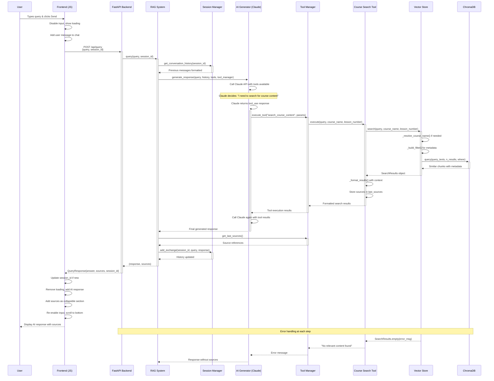

# RAG System Query Processing Flow



## Component Architecture

```mermaid
graph TB
    %% Frontend Layer
    subgraph "Frontend Layer"
        UI[HTML/CSS Interface]
        JS[JavaScript Controller]
        Chat[Chat Messages]
        Input[User Input]
    end

    %% Backend API Layer
    subgraph "Backend API Layer"
        FastAPI[FastAPI Server]
        Endpoints["/api/query, /api/courses"]
        CORS[CORS Middleware]
    end

    %% RAG System Core
    subgraph "RAG System Core"
        RAGSys[RAG System Orchestrator]
        DocProc[Document Processor]
        Config[Configuration]
    end

    %% AI & Tools Layer
    subgraph "AI & Tools Layer"
        AIGen[AI Generator]
        Claude[Anthropic Claude API]
        ToolMgr[Tool Manager]
        SearchTool[Course Search Tool]
    end

    %% Data & Session Layer
    subgraph "Data & Session Layer"
        VectorStore[Vector Store]
        ChromaDB[(ChromaDB)]
        SessionMgr[Session Manager]
        Memory[(In-Memory Sessions)]
    end

    %% Document Storage
    subgraph "Document Storage"
        Docs[/docs/*.txt files]
        Chunks[Text Chunks]
        Embeddings[Vector Embeddings]
    end

    %% Connections
    UI --> JS
    JS --> FastAPI
    FastAPI --> RAGSys
    RAGSys --> AIGen
    RAGSys --> SessionMgr
    AIGen --> Claude
    AIGen --> ToolMgr
    ToolMgr --> SearchTool
    SearchTool --> VectorStore
    VectorStore --> ChromaDB
    SessionMgr --> Memory
    DocProc --> VectorStore
    Docs --> DocProc
    DocProc --> Chunks
    Chunks --> Embeddings
    Embeddings --> ChromaDB

    %% Styling
    classDef frontend fill:#e1f5fe
    classDef backend fill:#f3e5f5
    classDef ai fill:#fff3e0
    classDef data fill:#e8f5e8
    classDef storage fill:#fce4ec

    class UI,JS,Chat,Input frontend
    class FastAPI,Endpoints,CORS,RAGSys,DocProc,Config backend
    class AIGen,Claude,ToolMgr,SearchTool ai
    class VectorStore,ChromaDB,SessionMgr,Memory data
    class Docs,Chunks,Embeddings storage
```

## Data Flow Summary

### 1. **Query Initiation**
- User types → Frontend captures → HTTP POST to `/api/query`

### 2. **Session Context**
- Session Manager retrieves conversation history
- Provides context for AI generation

### 3. **AI Processing**
- Claude receives query + history + available tools
- Decides autonomously whether to search or answer directly

### 4. **Vector Search** (if triggered)
- Course name resolution via semantic similarity
- Content search with metadata filtering
- ChromaDB returns top 5 similar chunks

### 5. **Response Generation**
- Claude synthesizes search results into coherent answer
- Sources tracked and returned separately

### 6. **Frontend Display**
- Markdown rendering for rich formatting
- Collapsible sources section
- Session continuity maintained

### Key Features:
- **Autonomous Tool Use**: Claude decides when to search
- **Semantic Matching**: Fuzzy course name resolution
- **Context Preservation**: Session-based conversation memory
- **Source Attribution**: Transparent information sourcing
- **Error Resilience**: Graceful fallbacks at each layer